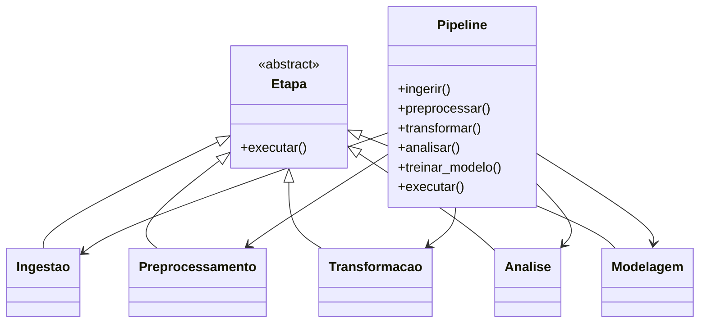
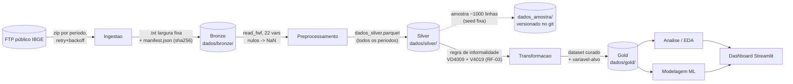

# Arquitetura — InformalidadeBR

Este documento descreve a arquitetura do pipeline de dados do
InformalidadeBR: os componentes, o fluxo de dados entre eles, as decisões
tomadas e como cada uma sustenta os Requisitos Funcionais
([RF](01-requisitos-funcionais.md)) e Não Funcionais
([RNF](02-requisitos-nao-funcionais.md)). A revisão de táticas
arquiteturais segue o vocabulário de Len Bass, Paul Clements e Rick
Kazman (*Software Architecture in Practice*) — cada atributo de qualidade
é sustentado por táticas concretas, não apenas por boas intenções.

## 1. Contexto e restrições

- **100% local**: sem infraestrutura cloud (sem AWS/SSM/RDS/EC2). Todo o
  pipeline roda em uma máquina de desenvolvedor/notebook.
- **Fonte única**: microdados da PNAD Contínua (IBGE), formato de largura
  fixa, baixados via FTP público.
- **Stack**: Python (pandas), Parquet como formato de armazenamento
  intermediário, scikit-learn para modelagem, Streamlit para apresentação.
- **Time**: 3 pessoas, projeto acadêmico com prazo definido — a
  arquitetura prioriza simplicidade e velocidade de iteração sobre
  escalabilidade horizontal.

## 2. Visão de componentes



`Etapa` é o contrato comum (padrão **Template/Strategy**): toda etapa
implementa `executar()` e é livre para expor seu próprio resultado
tipado (`ResultadoPeriodo`, `ResultadoPeriodoSilver`, ...) para quem
quiser inspecionar o que aconteceu — os notebooks usam isso para montar
tabelas-resumo em vez de depender só do log.

`Pipeline` é um **Facade**: conhece a ordem correta (ingestão →
pré-processamento → transformação → análise → modelagem) e expõe tanto a
execução completa (`executar()`) quanto cada etapa isolada — útil para
depurar uma etapa sem rodar as anteriores de novo.

## 3. Fluxo de dados (arquitetura Medallion)



| Camada | O que muda em relação à anterior | Componente responsável |
|---|---|---|
| **Bronze** | Nada — cópia byte a byte do que o IBGE publica. | `Ingestao` |
| **Silver** | Seleção das 22 variáveis relevantes, nulos explícitos, todos os períodos consolidados em um único arquivo. Ainda sem rótulos de categoria decodificados. | `Preprocessamento` |
| **Gold** | Regra de negócio de informalidade aplicada, filtro de pessoas ocupadas, dataset pronto para EDA/modelo. | `Transformacao` (TODO) |
| **`dados_amostra/`** | Não é uma camada Medallion — é uma amostra pequena e versionada da Silver + o dicionário do IBGE, só para navegação no GitHub (ver [`dados_amostra/README.md`](../dados_amostra/README.md)). | `scripts/gerar_amostra.py` |

## 4. Decisões arquiteturais

| Decisão | Alternativa considerada | Por que essa opção |
|---|---|---|
| Orquestração por classes Python (`Etapa`/`Pipeline`), não um orquestrador externo (Airflow etc.) | Airflow/Prefect | Escopo é um pipeline local de time pequeno rodando sob demanda, não um scheduler de produção — a complexidade de um orquestrador externo não se paga aqui. |
| Um único parquet consolidado na Silver (não particionado por ano/trimestre) | Parquet particionado (`ano=2024/trimestre=1/...`) | Volume (~5,7M linhas, ~63MB) ainda cabe confortavelmente em memória local; particionar só compensaria em volumes maiores ou leitura seletiva frequente por período. |
| Seleção de 22 variáveis já na Silver, não só no Gold | Levar as ~420 colunas até o Gold e filtrar depois | Reduz I/O e ruído desde cedo (ver "Relevância" no README); as 22 já foram validadas contra o dicionário do IBGE antes de qualquer código. |
| Decodificação de categorias (rótulos) adiada para depois da seleção/nulos | Decodificar tudo já na Silver | Escopo combinado: primeiro consolidar e garantir volume/qualidade, depois mapear código→rótulo — evita retrabalho se a lista de variáveis ainda mudar. |
| Amostra pequena versionada fora de `dados/` (`dados_amostra/`) | Forçar o Git a versionar a Silver inteira, ou usar Git LFS | `dados/` é grande demais e não deveria estar no Git de qualquer forma; LFS adicionaria dependência externa para um problema que uma amostra de ~1.000 linhas já resolve (dar visibilidade aos orientadores). |
| Ingestão sempre re-baixa e substitui (nunca assume que o local já é definitivo) | Pular download se o arquivo já existe localmente | O IBGE revisa/republica trimestres depois da publicação inicial — assumir "já tenho, não preciso baixar de novo" arriscaria trabalhar com dado desatualizado (ver RNF-01). |

## 5. Táticas arquiteturais por atributo de qualidade

Tabela de rastreabilidade entre RNF, tática arquitetural aplicada e onde
ela vive no código.

### Confiabilidade / Disponibilidade

| Tática (Len Bass) | Implementação | RNF |
|---|---|---|
| **Retry com backoff exponencial** | `Ingestao._baixar_com_retry` — até 3 tentativas, espera `2**tentativa` segundos entre elas. | RNF-02 |
| **Operação idempotente** | Cada período é baixado, extraído para um arquivo `.novo` e só then substitui o `.txt` final via `replace()` atômico — nunca fica com o arquivo pela metade se a extração falhar no meio. | RNF-01 |
| **Detecção de mudança de estado** | Checksum SHA-256 comparado com o manifesto anterior classifica cada execução como `baixado`/`substituido`/`sem_mudanca` — torna visível quando o IBGE revisou um período. | RNF-01, RNF-05 |

### Desempenho

| Tática | Implementação | RNF |
|---|---|---|
| **Redução de volume processado** | 22 de ~420 colunas lidas via `read_fwf(colspecs=...)` — não é preciso materializar as colunas irrelevantes em memória. | RNF-04 |
| **Formato colunar para leitura repetida** | Parquet na Silver (compressão + leitura por coluna) em vez de reprocessar o `.txt` de largura fixa toda vez. | RNF-03 |
| **Streaming no download** | `_baixar_com_retry` grava em chunks de 1MB (`iter_content`) em vez de carregar o zip inteiro em memória. | RNF-04 |

> **Pendência conhecida (RNF-04)**: o pré-processamento hoje carrega cada
> período inteiro em memória com `pandas.read_fwf` antes de concatenar.
> Funciona nesta escala (~500 mil linhas/período), mas não há leitura em
> chunks — se o volume crescer bem além disso, essa tática precisa ser
> revisitada.

### Segurança e governança

| Tática | Implementação | RNF |
|---|---|---|
| **Minimização de dados (allow-list)** | `Preprocessamento` só lê as 22 variáveis pré-aprovadas do dicionário — nenhuma coluna fora dessa lista chega à Silver, reduzindo a superfície de combinações que poderiam reidentificar alguém. | RNF-07 |
| **Segredos fora do versionamento** | Nenhuma credencial é necessária (fonte pública); `.env`/`.env.*` no `.gitignore` cobre o caso de precisar de uma no futuro. | RNF-08 |
| **Dado público na amostra versionada** | `dados_amostra/` só contém dado já anonimizado pelo IBGE — mesmo padrão de governança da Bronze/Silver completas. | RNF-07 |

### Observabilidade

| Tática | Implementação | RNF |
|---|---|---|
| **Log estruturado com timestamp** | `logging` configurado em cada etapa (`Ingestao`, `Preprocessamento`) com início/fim/duração. | RF-07 |
| **Métricas de reconciliação** | `ResultadoPeriodo`/`ResultadoPeriodoSilver` registram linhas de entrada vs. saída por período — dá pra somar e comparar Bronze → Silver. Hoje reconcilia **100%** (0 linhas perdidas) nos 12 períodos, após corrigir o bug de deduplicação descrito na [seção 9](#9-validação-com-agentes-de-ia-aiox). | RF-07, RNF-05 |
| **Proveniência por registro** | Manifesto JSON por período (`source_url`, `source_file`, checksum, `load_timestamp`) — qualquer linha da Silver é rastreável até o arquivo de origem. | RF-07 |

### Modificabilidade / Testabilidade

| Tática | Implementação | RNF |
|---|---|---|
| **Interface uniforme entre etapas** | `Etapa.executar()` — trocar a implementação de uma etapa (ex.: paralelizar a ingestão) não exige mudar `Pipeline` nem as etapas vizinhas. | — |
| **Etapas instanciáveis com caminhos customizados** | `Ingestao(caminho_saida=...)`, `Preprocessamento(caminho_entrada=..., caminho_saida=...)` — permite testar contra pastas temporárias sem tocar em `dados/` real. | — |
| **Resultados tipados e retornáveis** | `executar()` retorna a lista de resultados (não só loga) — os notebooks e testes futuros podem montar asserções/tabelas em cima disso, sem parsear log. | — |

### Reprodutibilidade

| Tática | Implementação | RNF |
|---|---|---|
| **Seed fixa** | `scripts/gerar_amostra.py` usa `SEED = 42` para o sorteio da amostra. **Ainda não implementado** no split/treino da modelagem — fica marcado como TODO em `src/modelagem/`. | RNF-12 |

## 6. Rastreabilidade RF → Componente

| RF | Componente | Status |
|---|---|---|
| RF-01 (Ingestão) | `src/ingestao/ingestao.py` | ✅ Implementado |
| RF-02 (Pré-processamento) | `src/preprocessamento/preprocessamento.py` | ✅ Seleção/nulos/consolidação implementados (0 linhas perdidas na reconciliação, ver seção 9) — decodificação de categorias pendente |
| RF-03 (Transformação/Gold) | `src/transformacao/transformacao.py` | ⏳ TODO |
| RF-04 (EDA) | `src/analise/analise.py` | ⏳ TODO |
| RF-05 (Modelagem) | `src/modelagem/modelagem.py` | ⏳ TODO |
| RF-06 (Interpretabilidade/Equidade) | `src/modelagem/modelagem.py` | ⏳ TODO |
| RF-07 (Observabilidade) | `logging` em cada `Etapa` + manifestos JSON | ✅ Implementado nas etapas existentes |
| RF-08 (Dashboard) | `dashboard/` | ⏳ TODO |

## 7. Riscos arquiteturais (resumo)

Detalhados em [RF](01-requisitos-funcionais.md#análise-de-risco-rf) e
[RNF](02-requisitos-nao-funcionais.md#análise-de-risco-rnf); os que mais
pressionam a arquitetura em si:

- **Acoplamento ao layout de colunas do IBGE**: as posições em
  `Preprocessamento.VARIAVEIS` são hardcoded a partir do dicionário atual.
  Se o IBGE mudar o layout entre revisões, a leitura quebra silenciosamente
  (colunas deslocadas) em vez de dar erro — mitigado parcialmente pelo
  dicionário ser rebaixado a cada execução da ingestão, mas a validação
  cruzada (RNF-06: nenhum código órfão) ainda não está automatizada.
- **Volume em máquina local**: 5,7M linhas cabem hoje; a arquitetura não
  tem um plano de particionamento/chunking para o caso de o escopo
  crescer (mais anos, mais variáveis).
- **Ausência de testes automatizados**: não há suíte de testes no
  repositório ainda — a tática de "resultados tipados e retornáveis"
  (seção 5) foi pensada para tornar isso barato de adicionar depois.
- ~~**Deduplicação sem chave real** (encontrado e corrigido — ver
  [seção 9](#9-validação-com-agentes-de-ia-aiox))~~.

## 8. Trabalho futuro

1. Regra de informalidade (RF-03) sobre `VD4009`/`V4019`/`VD4002` → Gold.
2. Decodificação de categorias na Silver (código → rótulo).
3. EDA ponderada por `V1028` (peso amostral).
4. Modelagem com seed fixa (RNF-12) e SHAP recortado por gênero/raça
   (RF-06/RNF-11).
5. Dashboard Streamlit consumindo o Gold.
6. Repetir uma revisão assistida por IA (seção 9) quando a Transformação
   (Gold) estiver pronta, para validar a regra de negócio de informalidade
   antes de travá-la.

## 9. Validação com Agentes de IA (AIOX)

Instalamos o [AIOX](https://github.com/SynkraAI/aiox-core) (`npx aiox-core
install --ide claude-code`), um framework open-source (MIT, ~3.100 estrelas)
que integra personas de agente (`@analyst`, `@data-engineer`, `@architect`
etc.) ao Claude Code, gravando configuração em `.aiox-core/`, `.claude/` e
`AGENTS.md`. Instalação não-destrutiva — só cria arquivos novos, nada do
código existente foi sobrescrito.

### O que descobrimos sobre a ferramenta

- **Desenho voltado a SaaS full-stack**: os presets de stack (PHP, Next.js,
  Angular+NestJS, Go, Java, Rust, C#) e o roteador de missões do agente
  `@data-engineer` (schema design, RLS, migrations Supabase) não têm
  equivalente para um pipeline Python/pandas — escolhemos `None - Let AIOX
  decide based on project` no instalador porque nenhum preset servia.
- **Limitação de sessão**: os subagentes nativos (`.claude/agents/*.md`,
  ex. `aiox-analyst`, `aiox-data-engineer`) só ficam disponíveis para
  invocação em uma sessão do Claude Code **nova** — o registro de agentes
  não recarrega no meio de uma sessão já aberta. Isso não impediu a
  validação: a task `analyze-brownfield` do próprio AIOX é executável
  diretamente (`.aiox-core/infrastructure/scripts/documentation-integrity/
  brownfield-analyzer.js`, documentada como *read-only*).

### Resultado da análise automática (`analyze-brownfield`)

```
Tech Stack: Python (detectado via requirements.txt)
Merge Strategy: parallel  (sem conflitos)
Recomendações: adicionar linting (Flake8) e workflows de CI/CD — nenhum bloqueador
```

### Achado de validação: bug de deduplicação

Revisando o pré-processamento com a mesma pergunta que se faria a um
`@data-engineer` ("essa mudança é adequada?"), percebemos que
`_limpar_dados` chamava `drop_duplicates()` sobre as 22 variáveis de
conteúdo selecionadas — sem nenhum identificador único de pessoa. Como
várias dessas colunas ficam nulas para quem está fora da força de trabalho,
pessoas **diferentes** podiam coincidir em todas as 22 colunas e ser
descartadas como "duplicata".

**Confirmado empiricamente** (2025Q4, antes da correção): 975 linhas
descartadas como duplicata, das quais **92 tinham `VD4009` preenchido**
(pessoas ocupadas, com dado de trabalho real — não podiam ser lixo/linha
vazia).

**Correção aplicada**: adicionamos os 4 identificadores únicos de pessoa
que o IBGE já disponibiliza no arquivo bruto (`UPA`, `V1008`, `V1014`,
`V2003` — não são features, só chave de deduplicação; ver
[dicionário de dados](03-dicionario-de-dados.md)) e trocamos a
deduplicação cega pela chave real (`Ano+Trimestre+UPA+V1008+V1014+V2003`).

**Resultado**: reprocessando os 12 períodos, 0 linhas descartadas (antes:
~11 mil no total) — confirma que eram todos falsos positivos, não
duplicatas reais. RNF-05 (reconciliação Bronze → Silver) passou a bater
100%.

Antes de estender a lista de variáveis, também varremos as ~420 variáveis
do dicionário completo do IBGE contra o escopo do projeto para confirmar
que não faltava nada além dos 4 identificadores — nenhuma outra lacuna
relevante foi encontrada (as demais são redundantes com o que já estava
selecionado ou fora de escopo, ex. as perguntas brutas por trás das
variáveis derivadas `VD4xxx` que já usamos).

### Como usar os agentes (quando disponíveis)

Numa sessão nova do Claude Code, aberta nesta pasta:

```
@analyst        # Atlas — pesquisa/análise (mission: analyze-brownfield, document-project, ...)
@data-engineer  # Dara — banco de dados (roteador voltado a Supabase; para este projeto,
                # dar a missão diretamente no prompt em vez de usar os comandos *padrão)
```

Como o roteador de missões do `@data-engineer` é centrado em SQL/Supabase,
o jeito produtivo de usá-lo aqui é **não** seguir seus comandos `*` padrão
(pensados para schema/RLS/migrations) e em vez disso descrever a tarefa de
engenharia de dados diretamente no prompt — como fizemos nesta validação.
